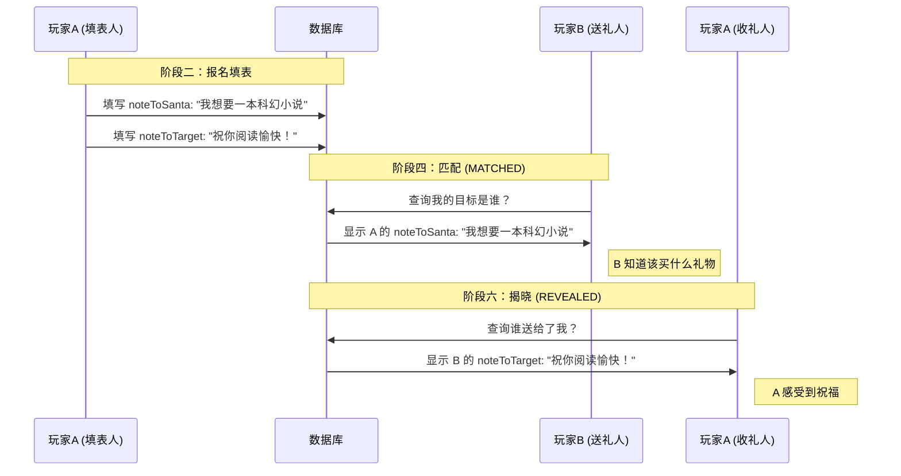

# 🎅 Project Vibe: Secret Santa (Web Application) - Product Requirements Document (PRD)

## 1. 项目概述

本项目是一个基于 Web 的轻量级“圣诞节互换礼物”辅助工具。
**核心理念**：去账号化（No-Account）、基于凭证（Key-based）、隐私优先。
**目标用户**：熟人社交圈（朋友、同事、社群）。
**主要功能**：房主创建活动、玩家通过邀请码填报信息、系统随机生成循环送礼名单、玩家查看送礼对象信息。

## 2. 技术栈 (Tech Stack)

* **Frontend & Backend Framework**: Next.js (App Router)
* **Database**: PostgreSQL
* **ORM**: Prisma
* **Styling**: Tailwind CSS + shadcn/ui (推荐，易于快速构建现代 UI)
* **Deployment**: Vercel (推荐) / Docker
* **Encryption**: Node.js `crypto` module (用于敏感字段加密存储)

---

## 3. 角色与权限 (Roles & Permissions)

### 3.1 房主 (Host)

* **凭证**：`Admin Key` (活动创建时生成，不可找回，需妥善保存)。
* **权限**：
  * 创建活动，设置截止时间。
  * 查看参与者列表（仅昵称、社交账号、**参与 Key**）。
  * **救援功能**：查看并复制某位用户的 `参与 Key` 发送给对方（用于找回）。
  * 剔除不符合要求的参与者。
  * 触发“开始抽选”（不可逆）。
  * 查看互换名单（默认防剧透，需主动揭示）。
  * 开启“公开送礼人”（允许玩家查看谁送给自己）。
  * 销毁活动（物理删除数据）。

### 3.2 参与玩家 (Participant)

* **凭证**：`Invite Key` (公共邀请码，进入活动)、`Participant Key` (个人唯一凭证，操作后续流程)。
* **权限**：
  * 使用 `Invite Key` 填写报名表单。
  * **活动状态=OPEN**：使用 `Participant Key` 修改个人资料。
  * **活动状态=MATCHED**：使用 `Participant Key` 查看**送礼目标**的详细信息（明文）。
  * **活动状态=REVEALED**：使用 `Participant Key` 查看**送礼给自己的人**的信息。

---

## 4. 核心业务流程与功能需求

### 4.1 阶段一：活动创建 (Creation Phase)

* **输入**：活动标题、描述（可选）、截止时间。
* **输出**：展示 `Admin Key` 和 `Invite Key`。
* **逻辑**：
  * Keys 应使用高熵字符串生成（如 CUID 或 UUID）。
  * **前端提示**：强烈警告房主保存 Admin Key。

### 4.2 阶段二：玩家报名 (Join Phase)

* **入口**：输入 `Invite Key`。
* **校验**：活动是否存在？是否已过截止时间？是否已抽选？
* **表单字段**：
  * **公开信息**：昵称（同一活动内唯一）、社交账号（QQ/Discord等）。
  * **隐私信息**（需加密存储）：手机号、收货地址、姓名。
  * **活动备注**：显示房主填写的活动规则备注（只读）。
  * **其他**：给送礼人的备注（noteToSanta）、给收礼人的备注（noteToTarget）。
* **提交后**：生成并展示 `Participant Key`。
  * **前端提示**：强烈建议截图保存，并告知若丢失可找房主。

### 4.3 阶段三：活动管理 (Management Phase)

* **入口**：输入 `Admin Key`。
* **功能**：
  * 列表展示：昵称 | 社交账号 | 状态 | 操作。
  * 操作包括：删除用户、**查看Key**（点击显示该用户的 Participant Key）。
  * 修改截止时间（仅在 OPEN 状态下）。
  * 修改活动备注（仅在 OPEN 状态下）。

### 4.4 阶段四：抽选匹配 (Matching Phase)

* **触发条件**：房主点击“开始抽选” && 当前时间 > 截止时间（可选强制执行） && 人数 >= 2。
* **算法逻辑**：
    1. 获取所有参与者 ID 列表。
    2. Fisher-Yates Shuffle 打乱列表。
    3. 构建循环链表：`List[i].target = List[i+1]`，`List[Last].target = List[0]`。
    4. 数据库事务更新：写入 `targetId`，将活动状态更新为 `MATCHED`。
* **约束**：一旦执行，活动状态锁定，不可新增人员，不可修改个人信息。

### 4.5 阶段五：结果查询 (Result Phase)

* **玩家视图**：
  * 输入 `Participant Key`。
  * **API 响应**：解密返回 `target` 用户的姓名、地址、电话、社交账号、给送礼人的备注（noteToSanta）。
  * **活动备注**：同时返回房主填写的活动规则备注（description）。
  * **默认**：不返回 `sender`（送礼者）信息。
* **房主视图**：
  * 展示匹配列表：`A -> B`, `B -> C`。
  * **防剧透设计**：默认隐藏“谁送给房主（当前Admin）”的条目，或默认折叠所有关系，点击“显示全部”才渲染。

### 4.6 阶段六：后续操作 (Post-Event)

* **公开送礼人**：房主切换开关 -> 活动状态 `REVEALED` -> 玩家接口可返回 `sender` 信息。
* **数据销毁**：房主点击“结束活动”或定时任务 -> 物理删除 Activity 及关联 Participants 的敏感字段。

---

## 5. 数据库设计 (Schema Design)

```prisma
// schema.prisma

datasource db {
  provider = "postgresql"
  url      = env("DATABASE_URL")
}

generator client {
  provider = "prisma-client-js"
}

enum ActivityStatus {
  OPEN      // 报名中
  MATCHED   // 已抽选，查看Target
  REVEALED  // 已揭晓，查看Sender
}

model Activity {
  id          String   @id @default(cuid()) // 对应 Invite Key
  adminKey    String   @unique @default(cuid()) // 管理 Key
  name        String
  description String?
  status      ActivityStatus @default(OPEN)
  deadline    DateTime
  createdAt   DateTime @default(now())
  
  participants Participant[]
}

model Participant {
  id           String   @id @default(cuid()) // 对应 Participant Key
  activityId   String
  nickname     String   // 昵称
  
  // --- 敏感信息 (存入数据库前需应用层加密) ---
  realName     String   // 真实姓名 (加密)
  socialAccount String  // 社交账号 (可不加密，便于房主确认身份)
  phone        String   // 手机号 (加密)
  address      String   // 地址 (加密)
  // ---------------------------------------

  noteToSanta  String?  // 给送礼人的备注（愿望清单、偏好等）
  noteToTarget String?  // 给收礼人的备注（祝福语等）

  // 关系映射
  targetId     String?  @unique // 我要送给谁 (Self-relation ID)
  target       Participant? @relation("GiftCircle", fields: [targetId], references: [id])
  
  sender       Participant? @relation("GiftCircle") // 谁送给我

  activity     Activity @relation(fields: [activityId], references: [id], onDelete: Cascade)

  @@unique([activityId, nickname]) // 保证同房间内昵称唯一
}
```

---

## 6. 字段使用逻辑说明 (Field Usage Logic)

### 6.1 字段语义澄清

Secret Santa 游戏中有两条完全不同的信息流，需要明确区分：

1. **给送礼人的备注 (noteToSanta)**：
   * **方向**：接收者 (Target) → 写给 → 送礼者 (Santa)
   * **内容**：愿望清单、偏好、收货提示等（如："我喜欢蓝色，尺码M，讨厌巧克力"）
   * **展示时机**：**MATCHED 阶段**，送礼者查看目标对象时显示
   * **UI 提示**：报名时提示"告诉你的神秘圣诞老人你喜欢什么？"

2. **给收礼人的备注 (noteToTarget)**：
   * **方向**：送礼者 (Santa) → 写给 → 接收者 (Target)
   * **内容**：祝福语、谜语、神秘人寄语等（如："圣诞快乐！希望你喜欢这份礼物"）
   * **展示时机**：**REVEALED 阶段**，接收者查看谁送给自己时显示
   * **UI 提示**：报名时提示"给那个你将要送礼的幸运儿留一句祝福吧"

### 6.2 交互流程示例

玩家A填写：

* noteToSanta: "我想要一本科幻小说"
* noteToTarget: "祝你阅读愉快！"

玩家B（抽到A作为目标）在 MATCHED 阶段看到：

* A的 noteToSanta: "我想要一本科幻小说" ← B知道该买什么

活动结束后，玩家A在 REVEALED 阶段看到：

* B的 noteToTarget: "祝你阅读愉快！" ← A感受到祝福

### 6.3 字段流向示意图



---

## 7. 安全与隐私规范 (Security Specifications)

1. **敏感数据加密 (Encryption at Rest)**:
    * **字段**：`realName`, `phone`, `address` 必须在写入数据库前加密。
    * **方案**：使用 AES-256-GCM 或类似对称加密算法。
    * **密钥管理**：密钥 (Secret) 存储在环境变量 `ENCRYPTION_KEY` 中，不入库。
2. **API 访问控制**:
    * 查询 `target` 信息接口：必须校验 `Participant Key` 有效性 + `Activity.status != OPEN`。
    * 查询 `sender` 信息接口：必须校验 `Participant Key` 有效性 + `Activity.status == REVEALED`。
3. **防撞库/爆破**:
    * 针对 Key 的查询接口增加 Rate Limiting (如每IP每分钟限制 10 次请求)。
4. **数据脱敏**:
    * 房主 API：即便是房主，调用获取参与者列表接口时，后端也严禁返回解密后的地址和电话，只返回昵称和社交账号。

---

## 8. UI/UX 建议 (UI Guidelines)

* **风格 (Vibe)**:
  * 节日氛围：圣诞红 (#D42426)、松树绿 (#165B33)、雪白、金色点缀。
  * 交互：卡片式设计，拟物化信封开启动效（查看结果时）。
* **移动端优先**: 绝大多数用户会在微信/Discord内置浏览器打开，确保响应式布局完美。
* **容错设计**:
  * Key 的输入框支持“一键粘贴”。
  * Key 的展示页面支持“一键复制”。
  * 长文本（如地址）输入框支持多行。

---

## 9. 开发路线图 (Roadmap for AI Vibe Coding)

1. **Step 1: Scaffolding**: 初始化 Next.js + Prisma，配置数据库连接。
2. **Step 2: Core Models**: 定义 Prisma Schema 并迁移数据库。
3. **Step 3: Encryption Utils**: 编写 AES 加解密工具函数。
4. **Step 4: Host Actions**: 实现创建活动、管理后台 API。
5. **Step 5: Player Join**: 实现报名表单、Key 生成逻辑。
6. **Step 6: Matching Logic**: 实现洗牌算法和数据库事务更新。
7. **Step 7: Reveal Interface**: 实现玩家查看结果的解密 API 和前端页面。
8. **Step 8: Polish**: 增加 UI 动效、防剧透开关、数据清理 Job。
